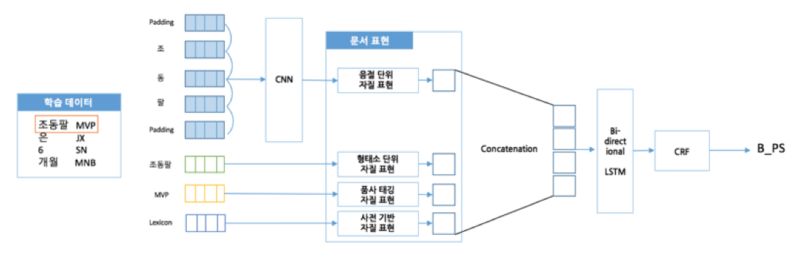
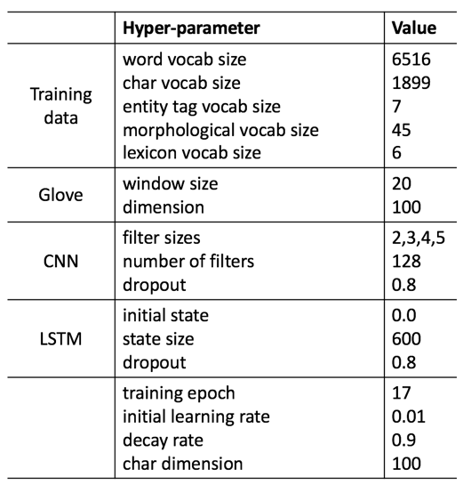
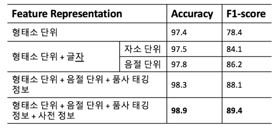

## KU_NERDY

‘KU_NERDY’는 고려대학교(Korea University)와 개체명 인식을 의미하는 Named Entity Recognition을 하나의 애칭처럼 부르기 위해 뒤에 DY를 붙여 이름을 지은 개체명 인식 시스템 입니다.

### Proposed Medthod

### Model Hyperparameter

### Results

